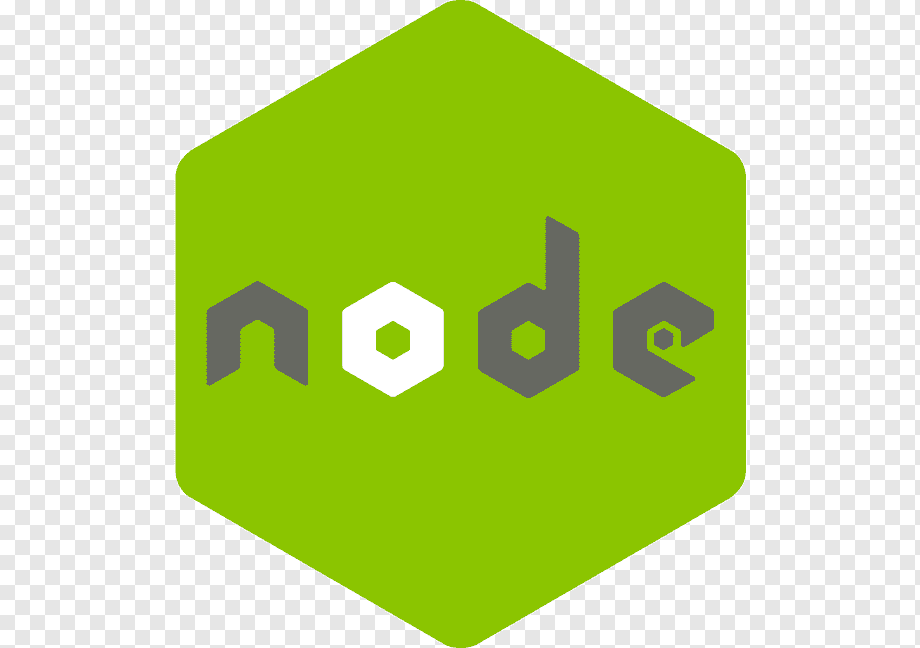

**Superheroes Base**

**Superheroes app** - this web application developed to be able to create your
own base of heroes. This version 0.0.1 allow to check all your heroes' base and
create a new hero. Next version will include next features:

- registration/ authorization
- the Hero card where you can have all details
- update hero's data.

**You can be a Hero for your country as well!!!**

# Built With

This section should list any major frameworks that I used to built the project.
Here are a few examples:

## Backend

Talking about what is going on under the skin?

Backend has been built on Express using database connected to MongoDB and
Cloudinary for saving pictures.

There have been developed all necessary routes for CRUD operation. API allows
create, update and delete hero item, delete pictures for particular hero. There
implemented pagination for get route.

# Все Буде Україна!!!

